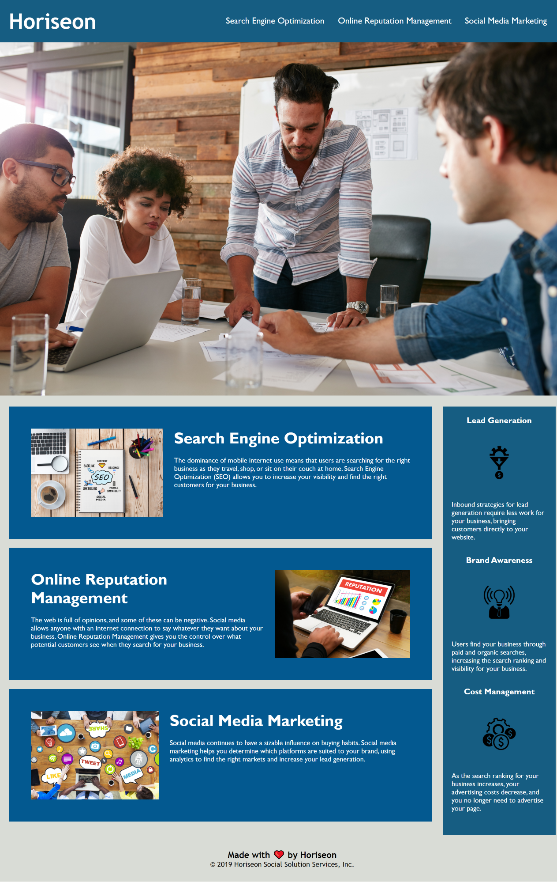

# Horiseon

**Horiseon** is a digital marketing ageny website.Existing code is refactored to meet certain set of standards to make website more accessible.It is important that the web be accessible to everyone in order to provide equal access and equal opportunity to people with disabilities.  
Accessibility is an important consideration for businesses as web accessibility ensures that people with disability can access a website using assistive tenchnology like video captions,screen readers,and barille keybooard ,inturn including more people in your business and give access to a larger pool of potential customers.

## Key Learning:

1.Usage of semantic HTML elements and logical structuring of web page.  
2.Learned attributes for html elements.  
3.Consolidating redundant CSS and CSS layout.  
4.Usage of Github (uploading and publishing on github).

## ScreenShot

## Deployed Application
